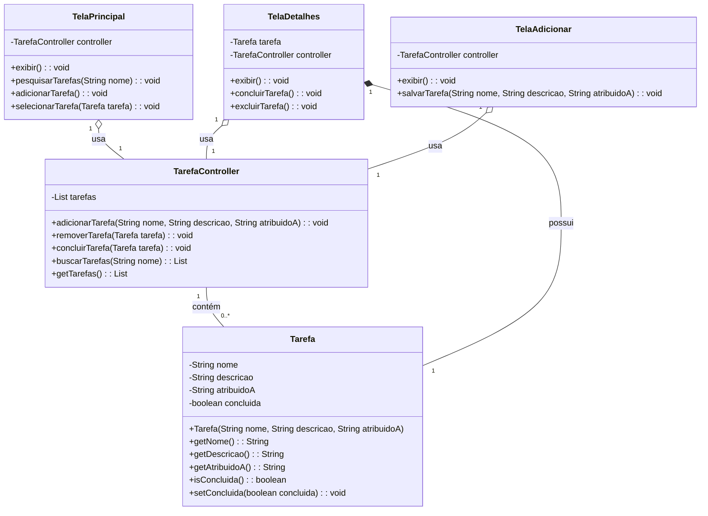

# ToDoList

ToDoList é uma aplicação de lista de tarefas simples construída com Spring Boot 3.2.8 e Java 17. A aplicação permite que os usuários criem, leiam, atualizem e excluam tarefas, além de buscar tarefas atribuídas a uma pessoa específica.

## Diagrama de Classe


## Funcionalidades

1. **Listar todas as tarefas**
   - Endpoint: `GET /api/tarefas`
   - Retorna uma lista de todas as tarefas.

2. **Obter detalhes de uma tarefa específica**
   - Endpoint: `GET /api/tarefas/{id}`
   - Parâmetro de caminho: `id` (ID da tarefa)
   - Retorna os detalhes de uma tarefa específica.

3. **Criar uma nova tarefa**
   - Endpoint: `POST /api/tarefas`
   - Corpo da requisição:
     ```json
     {
       "nome": "Nome da Tarefa",
       "descricao": "Descrição da Tarefa",
       "atribuidoA": "Nome da Pessoa"
     }
     - Cria uma nova tarefa com os detalhes fornecidos.

4. **Atualizar uma tarefa existente**
   - Endpoint: `PUT /api/tarefas/{id}`
   - Parâmetro de caminho: `id` (ID da tarefa)
   - Corpo da requisição:
     ```json
     {
       "nome": "Nome Atualizado",
       "descricao": "Descrição Atualizada",
       "atribuidoA": "Nome Atualizado",
       "concluida": true
     }
     ```
   - Atualiza os detalhes de uma tarefa existente.

5. **Excluir uma tarefa**
   - Endpoint: `DELETE /api/tarefas/{id}`
   - Parâmetro de caminho: `id` (ID da tarefa)
   - Exclui uma tarefa específica.

6. **Buscar tarefas atribuídas a uma pessoa específica**
   - Endpoint: `GET /api/tarefas/atribuidas/{nome}`
   - Parâmetro de caminho: `nome` (Nome da pessoa)
   - Retorna uma lista de todas as tarefas atribuídas a uma pessoa específica.
